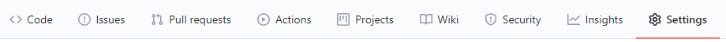
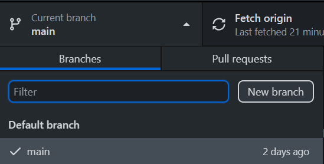
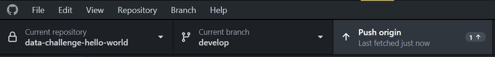

# Introduction to GitHub for the Crick Data Challenge #

GitHub houses the largest collection of source code from open source to private enterprise projects all over the world. It is used extensively by teams within software development companies and by individuals working on their own projects. If you want to manage a large code project, share your work, or collaborate with other developers, knowing how to use Git and Github is essential.

This guide is intended for beginners who are not familiar with git, GitHub and, to some extent, the command line. It shows how to use several tools with graphical user interface and keeps usage of the command line to the minimum required for the Crick Data Challenge. If you would rather see how to use git at the command line, [here is a good Crick workshop about it](https://github.com/FrancisCrickInstitute/git-workshop).

## Table of contents ##

- [Introduction to GitHub for the Crick Data Challenge](#introduction-to-gitHub-for-the-crick-data-challenge)
  - [Prerequisites](#prerequisites)
  - [Terminology](#terminology)
  - [Good practice](#good-practice)
  - [What are Git and GitHub](#what-are-git-and-github)
    - [But what is version control](#but-what-is-version-control)
    - [What about GitHub](#what-about-github)
    - [Decentralized, remote and local repositories](#decentralized-remote-and-local-repositories)
    - [Why use a local repository](#why-use-a-local-repository)
    - [Why not just write on GitHub directly](#why-not-just-write-on-github-directly)
  - [Getting familiar with the GitHub web interface](#getting-familiar-with-the-github-web-interface)
    - [Looking at a repository](#looking-at-a-repository)
    - [Creating a new repository](#creating-a-new-repository)
  - [Giving someone else access to the repository](#giving-someone-else-access-to-the-repository)
  - [Downloading the new repository locally on a desktop or laptop](#downloading-the-new-repository-locally-on-a-desktop-or-laptop)
    - [GUI client](#gui-client)
  - [Creating a new branch](#creating-a-new-branch)
  - [Making some changes and committing them to our local repo](#making-some-changes-and-committing-them-to-our-local-repo)
  - [Downloading the repository locally on the compute cluster](#downloading-the-repository-locally-on-the-compute-cluster)
    - [Setting up a SSH keys for your GitHub account](#setting-up-a-ssh-keys-for-your-github-account)
    - [Switching to the develop branch on the cluster](#switching-to-the-develop-branch-on-the-cluster)
  - [Creating a pull request](#creating-a-pull-request)
  - [Merging a pull request](#merging-a-pull-request)

## Prerequisites ##

Create a GitHub account at [GitHub.com](https://github.com/join). The credentials for that account are yours to choose, they are not linked to Crick credentials. Once you have a GitHub account it is recommended to enable Two-Factor Authentication (2FA) on it.

## Terminology ##

The following terms are also explained later in the guide, they are here as a quick reference.

- **Version Control System:** A version control system, or VCS, tracks the history of changes as people and teams collaborate on projects together.
- **Git:** Git is a software that helps you manage your code with version control.
- **GitHub:** GitHub is a code hosting platform for version control and collaboration. It lets you and others work together on projects from anywhere.
- **Repository:** A repository is usually used to organize a single project. Repositories can contain folders and files, images, videos, spreadsheets, and data sets – anything your project needs. There are file size limits however.
- **Branch:** Branching is the way to work on different versions of a repository at one time. When you create a branch off the `main` branch, you’re making a copy, or snapshot, of `main` as it was at that point in time.
- **git clone:** Cloning a repository means creating a local copy of a project that already exists remotely. The clone includes all the project’s files, history, and branches.
- **git add:** The `add` command stages a change. Git tracks changes to a developer’s codebase, but it’s necessary to stage and take a snapshot of the changes to include them in the project’s history. This command performs staging, the first part of that two-step process. Any changes that are staged will become a part of the next snapshot and a part of the project’s history.
- **git commit:** The `commit` command saves the snapshot to the project history and completes the change-tracking process. In short, a commit functions like taking a photo. Anything that’s been staged with `git add` will become a part of the snapshot with git commit.
- **Pull:** The `pull` command updates the local branch with updates from its remote counterpart. Developers use this command if a teammate has made commits to a branch on a remote, and they would like to reflect those changes in their local environment.
- **Push:** The `push` command updates the remote repository with any commits made locally to a branch.
- **Pull request:** A pull request provides your changes for repository owners to review.
- **Merge:** Merging two branches is typically used when a developer wants to combine changes from a feature branch into the `main` branch for deployment.
- **SSH Keys** provide provide a more secure way of authenticating to a server with SSH than using a password alone. Generating a key pair provides you with two long string of characters: a public and a private key. You can place the public key on any server, and then unlock it by connecting to it with a client that already has the private key.

## Good practice ##

- **Never write a password or other sensitive information in a file tracked by a repository.** If you accidentally commit sensitive data to a repository, you cannot simply remove the file from the folder and commit again, as the sensitive file is now in the history of the repository and its previous versions are visible. If this happens follow [these instructions](https://docs.github.com/en/free-pro-team@latest/github/authenticating-to-github/removing-sensitive-data-from-a-repository).
- Add a .gitignore file in your repository to exclude files containing sensitive information, large data files, files created by your operating system or code editor.
- GitHub is not meant to store large files and blocks pushes that exceed 100 MB. If you have committed a large file to your local repo but not pushed it yet, follow [these instructions](https://docs.github.com/en/free-pro-team@latest/github/managing-large-files/removing-files-from-a-repositorys-history).
- Do not commit directly to the `main` branch of a repository. Commit to another branch and open a pull request for it to be reviewed and merged into `main`.
- The code in the `main` branch of a repository should always be working, hence the recommendation to develop in a different branch and get the code reviewed by opening a pull request before changes get into the `main` branch.
- Commit and push often. The longer your local code stays away from changes made by your collaborators, the more complex it may become to integrate all the changes together.

## What are Git and GitHub ##

**Git** is a software that helps you save different versions of your code, using something called version control. **GitHub** is a website that stores your code. Together they help you manage code projects.

### But what is version control ###

Imagine spending days coding, making real progress, changing things around only to have something break? It was working fine before, and then a teeny tiny change broke the whole thing. But which change? How do you find it? Was it done by you or someone else in your team? How far do you backtrack changes? Does this mean you have to rewrite the code? If only you could roll back to a previous version, or at least find out what change set it off! Wouldn’t it be great to have a system that keeps track of all these changes? Wouldn’t it be useful if you could automatically save previous versions in an archive, just in case you need them again? Lucky for you, there is an awesome solution that does both of these things: version control.

With version control, there is a master version of the code. To work on it, everyone has to download a copy of it on their own computer. Everyone can work on it separately whenever they want.


When you're done, you send the document back, you can add a message to describe what changes you made, but instead of replacing the master version immediately, your new version is put on standby. This way your teammates can check your work before it gets integrated into the master document. If several people have modified the same version of the script, version control shows the different versions and allows you to pick which one to keep. The system automatically tracks who changed what and when. It is a lot easier to manage, and the system makes it easy to revert to an older version if someone made a mistake.

As mentioned earlier, the tool we use for version control is Git.

### What about GitHub ###

GitHub is a website that holds code repositories. But what is a code repository? It's a structure in which you store code. It is basically a folder on a computer, but when version control is used inside this folder we call it a repository, and it tracks all of the changes made to your project. And since GitHub repositories are in the cloud, you don't have to worry about losing your code if your computer crashes. You can think of GitHub as a library that stores code, and Git is the organisation system of the library.

As a side note, there are other git-compatible websites to store your repositories, for example BitBucket.

### Decentralized, remote and local repositories ###

Code repositories can be set up on a server, in a file on your own computer, and online! There are two main types: centralized and decentralized. A centralized repository typically has one copy of a file that everyone shares. These types of repositories allow members of a team project to work on the same file one after another; however, there is still the issue of two team members using the same file at the same time.

Git is based on using a decentralized or distributed system. In a decentralized system, you have one main repository, also called a **remote** repository, which contains code for a project. This main repository is hosted on servers. When developers want to work off of a remote repository, they create their own copy of that remote repository on their computers. When a copy of the remote repository is downloaded, it is called a **local** repository. And that's exactly the process we described before, we just didn't use the fancy terminology.

You'll remember, that since a repository is on their own computers, developers can work on any files they want for as long as they want, without affecting the code located in the main repository. So, now we have a decentralized system where local and remote documents can communicate back and forth with each other.


### Why use a local repository ###

It’s easier to write, build, and test your code using a compiler on your computer. Once it's completed, you can save it on your own computer, then send it back to your project on the GitHub main repository.

### Why not just write on GitHub directly ###

When working directly on GitHub, you can make a few small changes to the files in your repository and commit them, but **it's not a good practice** when making bigger code changes on large projects. Typically, large projects have a lot of people involved with a lot of moving parts. Also, the changes involve a lot of coding. GitHub isn’t built for continuously code writing - just storing it!

Additionally, with a local repository, you can still use a version control system directly on your computer. Since Git is a distributed system, you have all the same functionalities on your local repo as you do on GitHub. This includes updating between your local repository and your remote repository. Let’s say you were working on a pretty big project with a specific feature that has taken you two weeks to complete!  Meanwhile, other team members have probably changed the code in that main repository on GitHub. So what do you do if there have been changes on the remote repository, especially if it's connected to the feature you are working on?

Decentralized version control systems (DVCS) like Git allow you to update your local repository with any changes that were made to the remote repository while you were working. You can pull, or fetch, and update all the changes from the remote repository whenever you want with a simple command! This way, you can ensure that your local repository is current on all the changes and using the latest version of the project in the main repository.

## Getting familiar with the GitHub web interface ##

### Looking at a repository ###

First got to the [GitHub](https://github.com/) website. Depending on whether you are logged in or not, the landing page will look different. There are a lot of links giving you an idea of the tools GitHub has to offer. let’s check how repositories look.


With the search bar at the top, you can find a specific project/repository by name. Let's look at FastQC. Type `fastqc` in the search bar and hit enter.


As you can see a lot of repositories were found. You can click on any of them and see the source code. Check **s-andrews/FastQC**


There is a lot of new information. In the upper-left corner, you see the name of the repository. Underneath that, you will see these key tabs:

- Code - the source code.
- Issues - issues for the community to solve.
- Pull requests - suggestions from contributors.


You can also see a green **Code** button. When clicked, it gives you options to download the repository (more on that later).

Below that is a section showing you who commited the last changes that were integrated into the master version of the code. The commit message and commit identifier are also shown, as well as how long ago it was done and total number of commits made to the repository.


Further down you can see the number of contributors to the project and which programming languages are used.


### Creating a new repository ###

In the top-right corner of the web interface, there is a **+** button you can use to create a new repository.


When you create a new repository, if you are member of one or more GitHub organisations, you have the option to make the repository owned by yourself or by one of these organisations.


For this example we are going to make the oganisation FrancisCrickInstitute the owner. I am going to name the repo **data-challenge-hello-world** (no spaces should be used in repository names).

Another important thing to decide is the visibility of the repository. Two options are always available: Public or Private. If the organisation owning the repository is paying for enterprise features, Internal is also a choice.

- Public - Anyone in the world can see the repository.
- Internal - Other members of the organisation can see the repository, but other people cannot.
- Private - Initially only you can see the repository.

The visibility of the repository can be changed later. I set it to internal.

The rest is not mandatory, but it's a good idea to add a README file when creating a repository. The README file can provide information, description, updates and documentation about your project.

## Giving someone else access to the repository ##

To give someone else access, you need their github username. Or if your repo belongs to a github organisation you can also give access to an entire team at once. Go to the Settings tab for the repo.



Then on the left-hand side go to Manage access.


Then scroll down and simply click the green button.


## Downloading the new repository locally on a desktop or laptop ##

Downloading a remote repository to get a local copy is called **cloning** a repository. There are several ways to do that depending on your setup.

### GUI client ###

There are a variety of git clients with a graphical interface. You can see a list [here](https://git-scm.com/downloads/guis). If you are on Windows or MacOS, I would recommend using [GitHub Desktop](https://desktop.github.com/). It is developed by GitHub and easy to use (for command line access please see below, the part about cloning on the computer cluster). Once you have installed it, sign in with your GitHub account so the application can download non-public repositories you have access to. Then clone the repository we just created.


After cloning the repository, you can use the button **Fetch origin** to make sure you have downloaded the latest version from the remote repository.


## Creating a new branch ##

You may have noticed the **Current branch main** button in the GitHub desktop interface, or the branch dropdown menu on GitHub.com.


Branching is the way to work on different versions of a repository at one time. By default your repository has one branch named `main` (it used to be called `master`) which is considered to be the definitive branch. A good practice is that **the code in the main branch should always work**. So we use other branches to experiment and make edits before committing them to main.

When you create a branch off the main branch, you’re making a copy, or snapshot, of main as it was at that point in time. If you think of your project as a tree trunk, different versions can build off the main code like branches.


You can create your own branch, where you work and make changes without affecting the main version of the code. This version can later be reconnected to the main tree trunk or the master branch.


Different organisations, teams and individuals manage their branches in different ways. A common way is to create a new branch every time you start developing a new feature, this is the [GitHub Flow](https://githubflow.github.io/). At the very least, you repository should have a branch called `develop` used for active development, and only code that is working should be merged from `develop` into `main` or `master`.

So let's create a new branch in GitHub Desktop and call it `develop`.



Now the branch `develop` exists in our local repository as a snapshot of `main`. Before making any changes we can already publish the new branch on the remote repository.


Now if you go back to the repository on github.com you can see the new branch.


## Making some changes and committing them to our local repo ##

We now have our local copy of the repository. We're ready to make some changes. For that we will need a text editor. If you don't already have a favorite one, I would recommend [Visual Studio Code](https://code.visualstudio.com/) (not to be confused with Visual Studio) or [Atom](https://atom.io/), both are available for Windows, macOS and Linux.

For this example I am going to create a python file in the repository with the following content:

```python
print("Hello world")
```

Now that the file is created and saved, let's see what GitHub Desktop shows us.


The app shows us we have added the file *hello.py* and edited *README.md*, along with the modified content in each file. By default GitHub Desktop automatically adds all new files to the next commit, however if your repository folder contains files that you do not want to be tracked by the repository, you can add a file called *.gitignore* and use it to ignore some files when you commit. This is described [here](https://git-scm.com/docs/gitignore).

**IMPORTANT**: if your repository contains files with sensitive information (for example your password) make sure you add those files to *.gitignore* before you do any commit. If you add them later they will already be visible in the changes tracked by Git and potentially be visible by other people on github.com.

In the bottom-left corner of the app, we can add a message and commit our changes to the `develop` branch.


Now the changes have been **committed** to our local `develop` branch, we can **push** them to the remote `develop` branch.



We can see the new file on github.com if we switch to the develop branch!


## Downloading the repository locally on the compute cluster ##

Now that we have written a script, we want to test it to make sure it works before we merge the `develop` branch into the `main` branch. We will do this on the compute cluster. You should already have access to a login node.

**Note:** The command line steps below are not just valid for a compute cluster, they can also be used from Linux desktops and from macOS.

To clone a github repository from the command line, we need to use the command `git clone` followed by the URL of the repository. To find that URL, we can look at the repository on the web and click the green **Code** button.


This gives us a URL like this: `https://github.com/FrancisCrickInstitute/data-challenge-hello-world.git`. The command is then `git clone https://github.com/FrancisCrickInstitute/data-challenge-hello-world.git`. Let's try it. (The `module load` step below might not be necessary depending on your setup)

```bash
$ module load git
$ git clone https://github.com/FrancisCrickInstitute/data-challenge-hello-world.git
Cloning into 'data-challenge-hello-world'...
Username for 'https://github.com': mescuder
Password for 'https://mescuder@github.com':
remote: Invalid username or password.
fatal: Authentication failed for 'https://github.com/FrancisCrickInstitute/data-challenge-hello-world.git/'
```

The first thing we notice is that we are asked to authenticate. This is normal as our repository is not **Public**, github needs to make sure our account has permission to read the repository. It asks for username and password, but still the authentication failed. This happens if you have enabled multi-factor authentication on your GitHub account or if the repository is owned by an organisation that has enabled Single Sign On (SSO) for its members. In my case here, to access the repository on the github website, I have to log into my github account, which requires username, password and a code via an authenticator app on my phone. On top of that the repo belongs to the FrancisCrickInstitute organisation which has enabled SSO, so I also have to login with SSO using my work credentials and a code from the authenticator app again. The problem now is that the `git` command only supports username and password but not multi-factor authentication. The solution for that is SSH keys.

### Setting up a SSH keys for your GitHub account ###

You're probably already using a SSH keys to connect to the cluster login nodes. SSH keys (secure shell keys) are used to authenticate you without username and password. To generate a new SSH key pair, use the commands below, replacing the comment between quotes with whatever you want, it is just for you to remember what this key is for:

```bash
mkdir -p ~/.ssh

chmod 700 ~/.ssh

cd ~/.ssh

$ ssh-keygen -t rsa -b 4096 -C "cluster_github"
Generating public/private rsa key pair.
Enter file in which to save the key (~/.ssh/id_rsa): cluster_github_id_rsa
Enter passphrase (empty for no passphrase):
Enter same passphrase again:
Your identification has been saved in cluster_github_id_rsa.
Your public key has been saved in cluster_github_id_rsa.pub.
The key fingerprint is:
SHA256:/fnOouIFYUXpE0VWZ+LqQMQMGgOxvCmE/sK2JOjv+jE cluster_github
The key's randomart image is:
+---[RSA 4096]----+
|    ooo .=+++.o o|
| . . . + o=. . + |
|. . o . o...  .  |
|..   o . +o  .   |
| .. o   S o..    |
|o ..     . + .   |
|o= E      . +    |
|= o o   ..  .o   |
| +=+   ..... o+  |
+----[SHA256]-----+
```

The command generated two files: *cluster_github_id_rsa* and *cluster_github_id_rsa.pub* (the default name would be *id_rsa* and *id_rsa.pub*, but we do not want to overwrite them in case we already have them for another key) . The first one is your private key, and no one should be able to see it, it would be like giving your password. The second file is your public key that you need to add to your github account. First display the key.

```bash
$ cat cluster_github_id_rsa.pub
ssh-rsa AAAAB3NzaC1yc2EAAAADAQABAAACAQC+uF/iLa8F2yBcCG/U4V4wDSRFa06tBqq1q1baTmIng4QahtJ4zuys1fxgnYt9q5RJT/U57sgco4uShxtZT8MMo7D49M4rd0njxA5LKlJ2ZtnLl84etzsZU2pQ68NqPVkEmoHk2JCVcSssDjN0059INk7OYpJn82tWhZ8Qq05w+MjyuNcBdovBnoE2Hf5n5p3ZlRd3g38fxARHRSirZ8tOHZjX1x6sWwicM5tjes1zWETjzOPY2R3QAplxgoTNjZxlu3Wvx4NIP0yHOLiY8iQTgtItNBEU+R/uY5thnCc7Y4ROctQGvcjLtTj9OZs7+wiTh/WLZMX0Lf+lZ3BJtLDNJhhdSk2bHsEqHCDPGx7hYGiRqbcDlGL0rcxp44XEVNIQnKIBuC/sY/7205fdLE4JrUINKr8UijYzOScvXWw7lXuUWOTgBie9U9cM2VjdfiZqF4H+ZVBVqtUxfk1+opQsUp6zWc+FuPP+SocN4VYU+4e0PjOMxcitoKVV337tzxbc/I2eOApkRSomBGdIieqH0fRcjnevkrO8TfkfwE0bgqSa35EemYxvOVUeFv4aXBbY2ZjtulsqWxEgK4rKHYLBTgOUmS+BQRwF8gWoJaaUkriN+OEKmnC0nRzBnJTnblGZVclPycEE39ST5yMLKPwy3LhgFZCTdcBdHgljbCTB+Q== cluster_github
```

Your key is the entire text starting with `ssh-rsa` and finishing with the comment you used in the command to generate the pair. Copy that text to your clipboard and head your [github profile](https://github.com/settings/keys).  You can click the green button **New SSH key** in the top-right corner. Give a title to the key to remember where you are using this one, for example `compute cluster`. Then paste your public key below and confirm by clicking the green button again (at that point you may need to input your github password again).


If the repository is owned by an organisation using SSO, you will also need to enable SSO for that SSH key (at that point you will have to authenticate with SSO again).


Now we need to get the SSH URL for the repository, as SSH key authentication does not work with the HTTPS URL we used before. We can go back to the repo and click the green **Code** button again, but this time choose SSH instead of HTTPS.


This gives us a URL like this one: `git@github.com:FrancisCrickInstitute/data-challenge-hello-world.git`. The last step we need is a way make the git command find our SSH private key when we want to interact with a URL starting with `git@github.com`. For this we need an SSH config file. Create/edit the file `~/.ssh/config` and add the following content to it:

```bash
Host github.com
    HostName github.com
    User git
    IdentityFile ~/.ssh/cluster_github_id_rsa
    IdentitiesOnly yes
    ForwardAgent yes
```

Once that's done we can clone the repo using the SSH URL.

```bash
$ git clone git@github.com:FrancisCrickInstitute/data-challenge-hello-world.git
Cloning into 'data-challenge-hello-world'...
remote: Enumerating objects: 7, done.
remote: Counting objects: 100% (7/7), done.
remote: Compressing objects: 100% (5/5), done.
remote: Total 7 (delta 0), reused 4 (delta 0), pack-reused 0
Receiving objects: 100% (7/7), done.
```

### Switching to the `develop` branch on the cluster ###

By default `git clone` sets the local branch to be `main`, but our script to test is on the `develop` branch. So first we'll want to move into the newly cloned repository, then we can check which files are there and on which branch we are before changing to the `develop` and checking again. (The `module load` step below might not be necessary depending on your setup)

```bash
$ cd data-challenge-hello-world/

$ ll
total 0
-rw-r--r-- 1 escudem domain_users 62 Oct 12 16:26 README.md

$ git status
On branch main
Your branch is up to date with 'origin/main'.

nothing to commit, working tree clean

$ git checkout develop
Branch 'develop' set up to track remote branch 'develop' from 'origin'.
Switched to a new branch 'develop'

$ git status
On branch develop
Your branch is up to date with 'origin/develop'.

nothing to commit, working tree clean

$ ll
total 0
-rw-r--r-- 1 escudem domain_users 21 Oct 12 16:38 hello.py
-rw-r--r-- 1 escudem domain_users 65 Oct 12 16:38 README.md
```

Our script is there so we can test it.

```bash
$ module load Python/3.6.6-foss-2018b

The following have been reloaded with a version change:
  1) GCCcore/8.3.0 => GCCcore/7.3.0                                 4) ncurses/6.1-GCCcore-8.3.0 => ncurses/6.1-GCCcore-7.3.0
  2) XZ/5.2.4-GCCcore-8.3.0 => XZ/5.2.4-GCCcore-7.3.0               5) zlib/1.2.11-GCCcore-8.3.0 => zlib/1.2.11-GCCcore-7.3.0
  3) libxml2/2.9.9-GCCcore-8.3.0 => libxml2/2.9.8-GCCcore-7.3.0

$ python3 hello.py
Hello world
```

It works! So we can merge the `develop` branch into the `main` branch. For that we need to open a **Pull request**

## Creating a pull request ##

Pull Requests are the heart of collaboration on GitHub. When you open a pull request, you’re proposing your changes and requesting that someone review and pull in your contribution and merge them into their branch. Pull requests show diffs, or differences, of the content from both branches. The changes, additions, and subtractions are shown in green and red.

As soon as you make a commit, you can open a pull request and start a discussion, even before the code is finished. By using GitHub’s @mention system in your pull request message, you can ask for feedback from specific people or teams, whether they’re down the hall or 10 time zones away.

You can even open pull requests in your own repository and merge them yourself. It’s a great way to learn the GitHub flow before working on larger projects.

You can open pull requests from github.com or from the GitHub Desktop app.


This opens a web page on github.com to create the pull request. Give a pull request a title and write a brief description of the changes. You can also assign specific people to review the changes and approve them.


When you're done, click the green button to create the pull request.

## Merging a pull request ##

The next screen shows the details of the pull request and the status if review was requested. For this example we can directly merge the pull request.


Now that it's done, if we go back to the repository the python script will be visible in the `main` branch.


Now people not contributing but using your code can simply download from the main branch and are sure the code will work.
